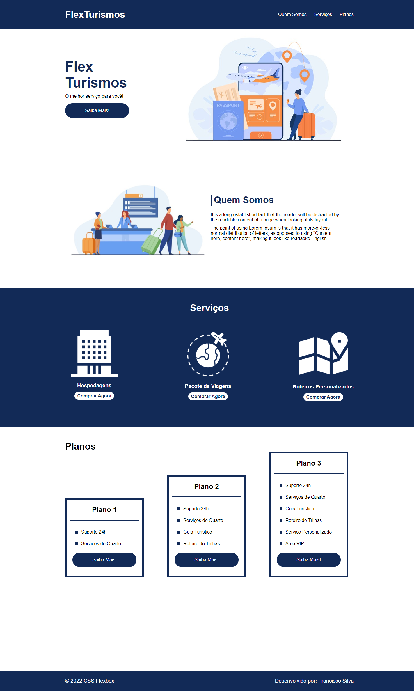

# Tourism Agency Landing Page

This Tourism Agency Landing Page is a website designed to promote a tourism agency and showcase its services. The website uses HTML and CSS to create a static, informative and visually appealing website.

## Features

- Attractive and responsive design
- Clear navigation and easy access to relevant information
- Detailed descriptions of services offered
- High-quality images that showcase the destinations and activities offered

## Technologies Used

- HTML5: Used to structure the website's content and layout.
- CSS3: Used to style the website's layout and design, including color schemes, typography, and animations.

## Usage

To view the website, simply visit the live site or download the project files and open the `index.html` file in your preferred web browser. The website can be easily customized and modified to fit your specific business needs.

## Contributing

Contributions to this project are welcome! Feel free to fork this repository and submit a pull request with your changes.

## Credits

This project was built by [Francisco Silva](https://github.com/Burntroll).

## License

This project is licensed under the [MIT License](https://opensource.org/licenses/MIT).

## Results

